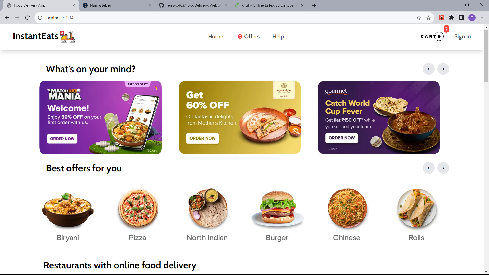

# Food Delivery 🚀

  
  

 Header
  - logo
  - Links

Body
  - search 
  - Restaurants Container
     - Restaurants Card
        -img
        -name of restaurants
        -star rating
        -cuisines
        -delivery time

Footer
  - copyright
  - links
  - address
  - contact

Different Compoenents
  - Header
  - Body
  - Restaurants Cards

Utils
  - constants
  - mockData

Filter Top Rated Restaurants
  - Ratings 4.0+

Routing
- createBrowserRouter
- RouterProvider
- Link
- Error Page
- Error element
- use route Hook
- Outlet

# Redux Toolkit
  - Install @reduxjs/toolkit and react-redux
  - Build our Store
  - Connect our Store to our app
  - Slice (cartSlice)
  - dispatch(action)
  - Selector
